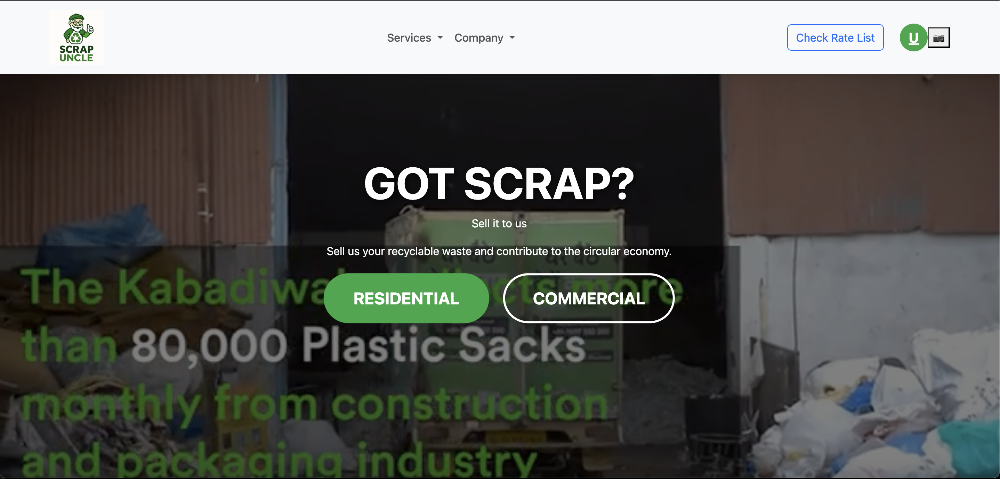
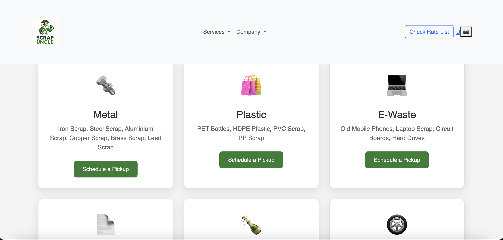
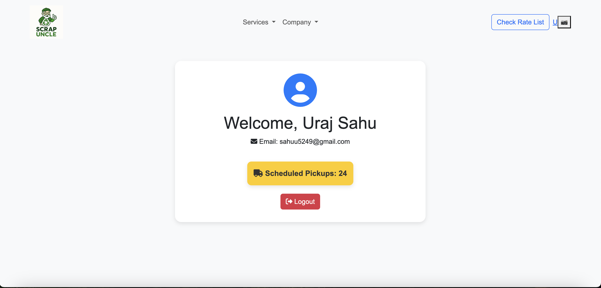

  

<h2 align="center">♻️ Mr. Scrap – Smart Scrap Collection System</h2>

  A Laravel-based platform to digitize the scrap collection process for residential and commercial users.

---

## 🚀 About the Project

**Mr. Scrap** is a full-featured scrap collection system built with Laravel and MySQL.  
It allows users to schedule pickups, track payments, and manage scrap types — all in one place.

## 🧩 Features

- User registration & login with OTP verification  
- Schedule scrap pickup for residential or commercial areas  
- Admin dashboard to manage users, pickup requests, and scrap categories  
- Pickup Man dashboard to view assigned pickups and update status  
- Analytics on total scrap, pending pickups, and most-picked scrap types  

## 🛠️ Tech Stack

- **Frontend:** HTML, CSS, Bootstrap, Tailwind CSS  
- **Backend:** Laravel (PHP)  
- **Database:** MySQL  
- **Auth:** OTP-based login system  
- **APIs:** RESTful services for user, pickup, and admin modules  

## 📷 Screenshots 

### 🏠 Home Page

### 🔐 Login Page

### 🧾 Pickup Request Form

### 🗂️ Admin Dashboard

